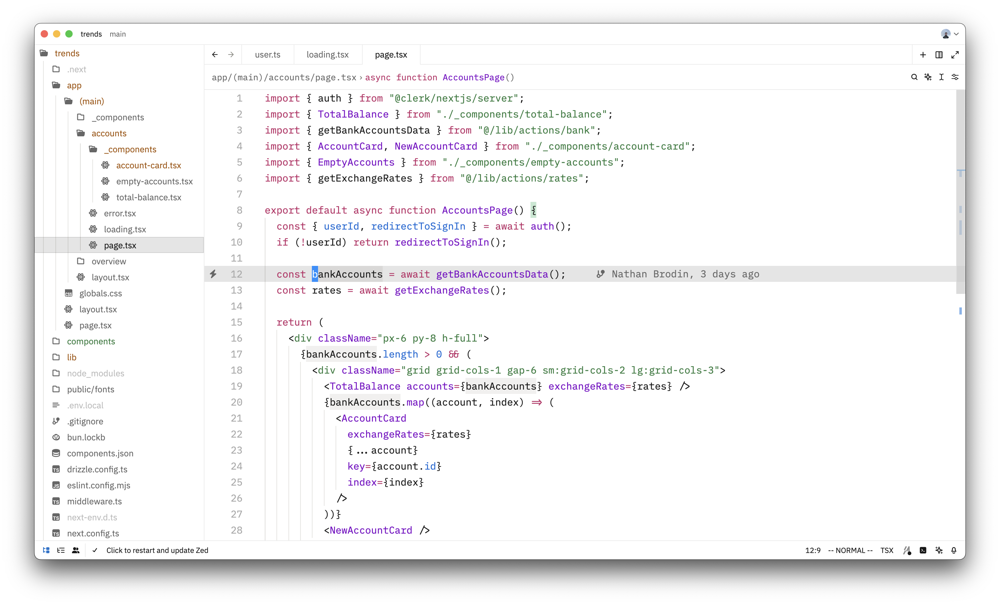
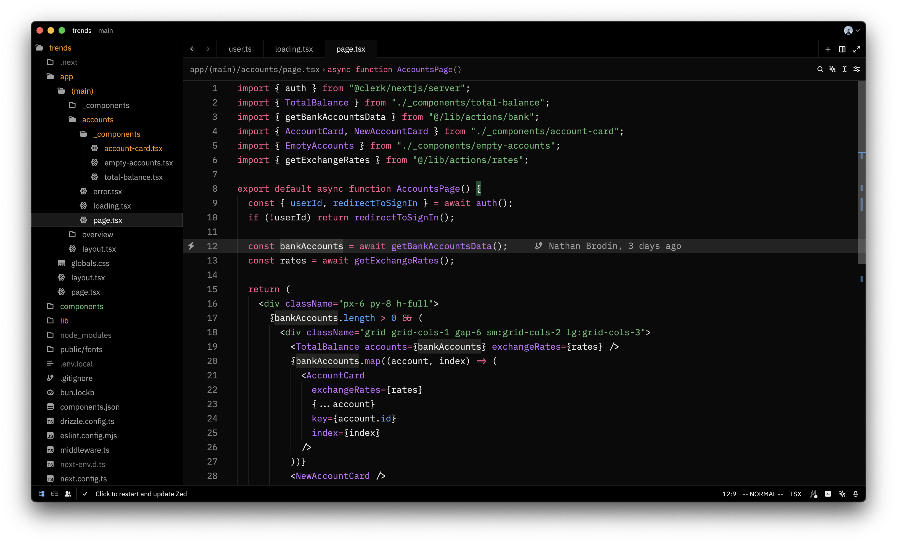

# zed-vercel-theme
The [Vercel](https://vercel.com) Theme, for [Zed](https://zed.dev)

## Light



## Dark



## How to update the extension

1. navigate to [extenstion.toml](./extension.toml) and bump version

2. Commit and push
```
git add .
git commit -m ""
```

3. Create a tag and push it
```
git tag v0.0.x
git push origin v0.0.x
```

## Acknowledgment

Made by converting this [VSCode theme](https://github.com/gantoreno/vscode-vercel) made by [@gantoreno](https://github.com/gantoreno) using [Zed theme importer](https://zed.dev/blog/user-themes-now-in-preview), and tweaking a few colors.
